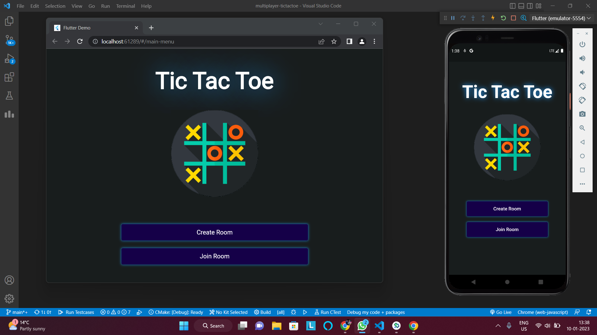
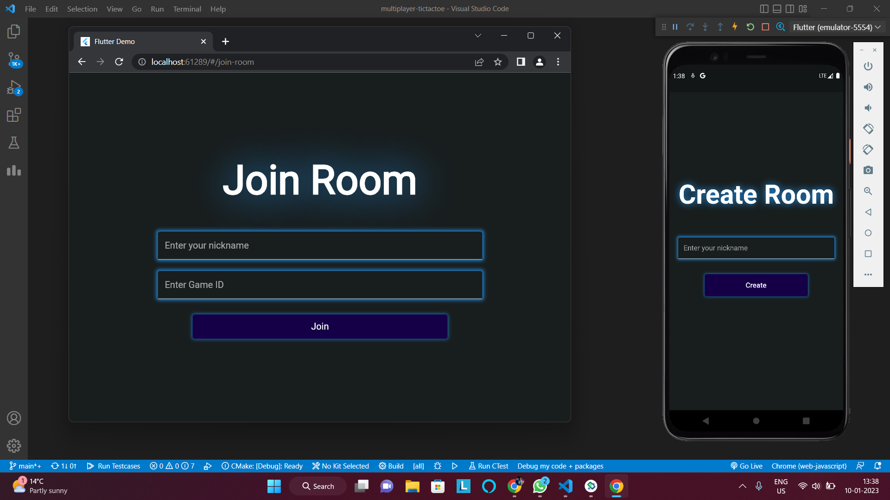
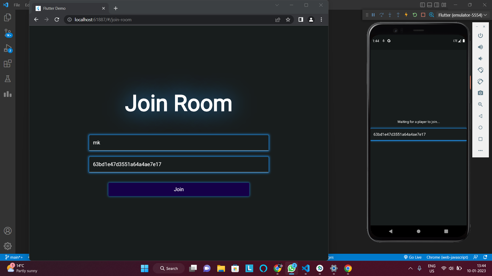
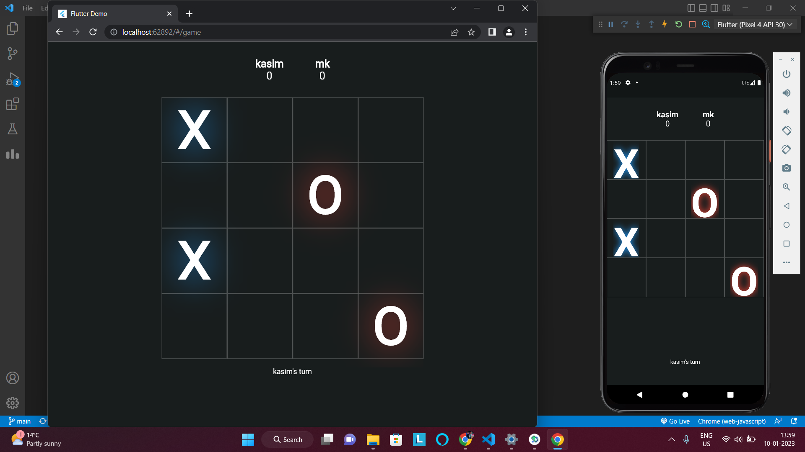
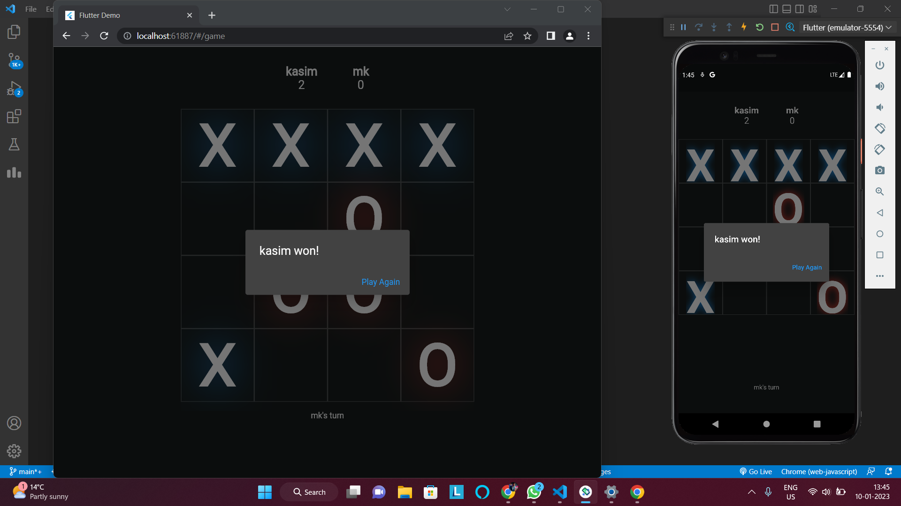

# Multiplayer TicTacToe Game

A completely Responsive Multiplayer 4x4 TicTacToe Game that works on Android, iOS, Desktop, Mac & Web.

## Features
- Create/Join Room
- Play Realtime
- Display Points
- Round & Game Winner
- Responsive Glow Themed UI
- Cross Platform Game

## Tech Used
**Client**: 	

**Server**:    

## Screenshots
### Home Screen

### Create/Join Room

### Joining Room

### Game Screen

### Game Finish



## Installation
1. Clone the repository
```bash
git clone https://github.com/Thekasim786/MultiplayerTicTacToe.git
```
2. Migrate to MultiplayerTicTacToe folder
```bash
cd MultiplayerTicTacToe
```


3. Install dependencies (Client Side)
```bash
flutter pub get
```

4. Install dependencies (Server Side)

```bash
cd server && npm install
```

5. Start the server

```bash
npm run dev
```

6. Run App
```bash
flutter run // After selecting the device you want to test on
```


    
## Feedback

If you have any feedback, please reach out to me at mohammadkassimmalik1@gmail.com.

